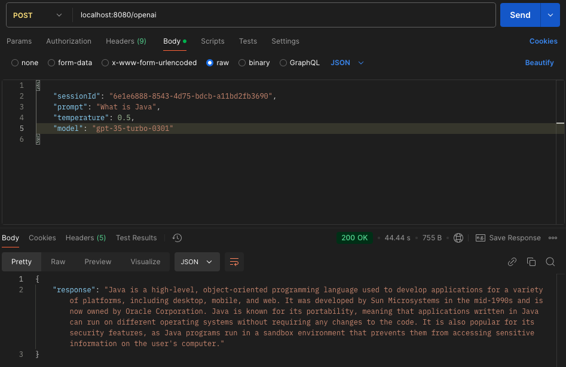
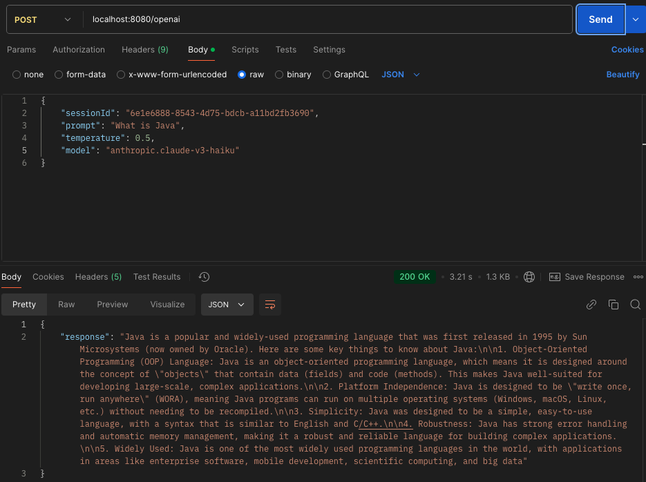
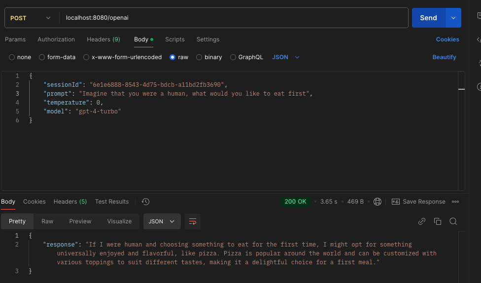
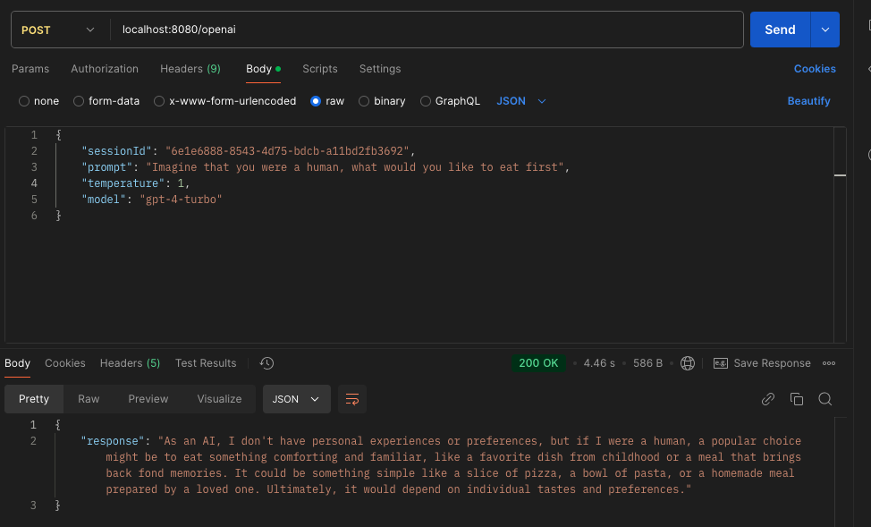

## Task 3 results

### 1. The same prompts using different models
"What is Java?"
- Result with GPT-35-turbo-0301

- Result with anthropic.claude-v3-haiku

### 2. With different PromptExecutionSettings
"Imagine that you were a human, what would you like to eat first"
Used: gpt-4-turbo
- Result with temperature 0

- Result with temperature 1

### 3. Observations and differences in the results
By using different models you can get different results because they are trained on a different sets of data.
So if you have a specific task, it is important to find proper AI for this.
For example, **anthropic-claude** can perform complex cognitive tasks, so it is useful for vision analysis and code generation.

By using different prompt execution settings, such as temperature or max tokens, you can influence the AI's output to get a more relevant answer for you.

